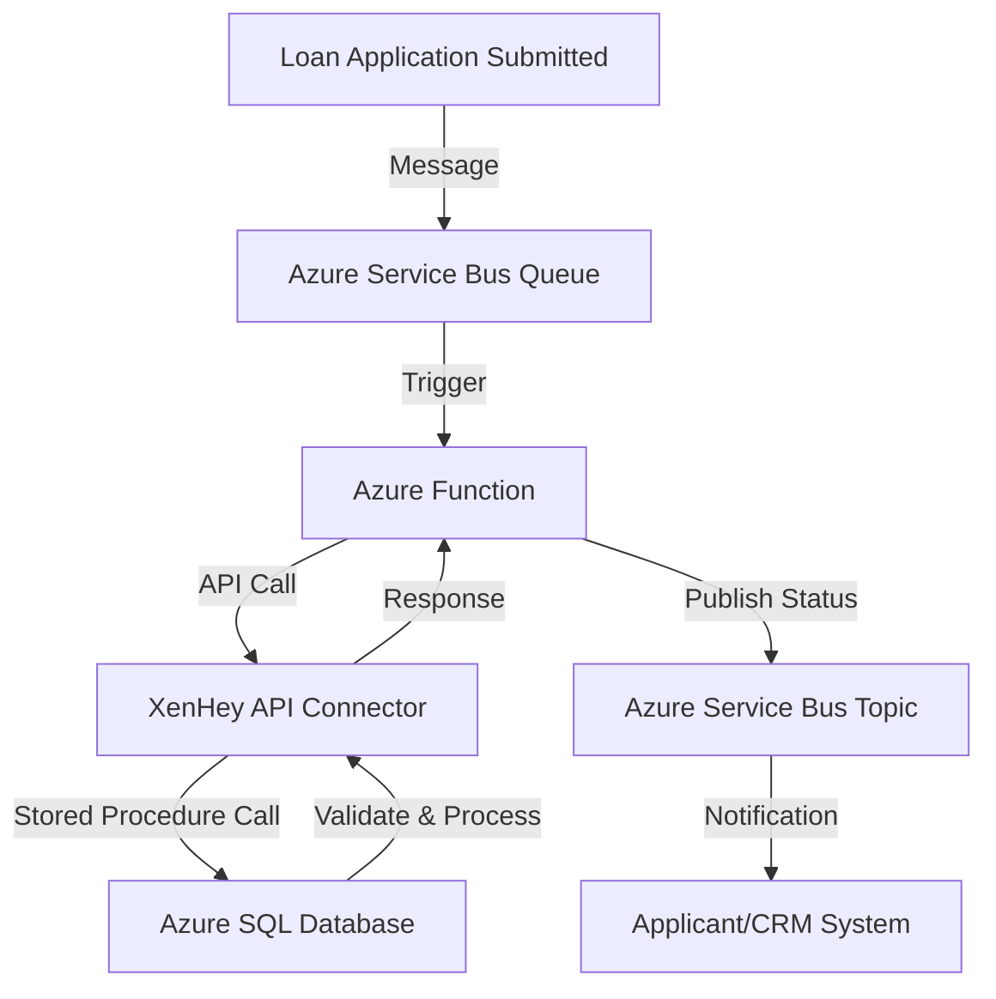

# AzureServiceBusToSQL
### **Use Case: Automated Loan Processing in Financial Services**

**Overview:**
A financial institution wants to automate the loan application processing pipeline by integrating multiple systems. The goal is to receive loan application requests, process them using Azure Functions, and store the results in an Azure SQL database. XenHey's API connector is used to expose Azure SQL stored procedures and views for real-time data retrieval and updates, while Azure Service Bus ensures reliable messaging between systems.

---

### **Use Case Description:**

**Problem Statement:**
- Loan applications arrive from multiple channels (web, mobile, and third-party systems).
- The processing pipeline requires the orchestration of real-time validation, calculations (e.g., credit score assessments), and updates to the Azure SQL database.
- The institution seeks a scalable, secure, and efficient way to automate this process without building extensive custom APIs.

**Solution with XenHey:**
- **Azure Service Bus** handles incoming loan application messages.
- **Azure Functions** processes the messages and calls XenHey’s API connector to interact with Azure SQL.
- **XenHey** exposes Azure SQL stored procedures to validate loan applications, calculate eligibility, and update the application status.

---

### **Workflow Steps:**

1. **Loan Application Submission**:
   - Loan applications are submitted via a web or mobile interface and sent to Azure Service Bus as messages.
   
2. **Message Processing**:
   - Azure Functions listens to the Service Bus queue for incoming loan applications.
   
3. **Database Interaction**:
   - Azure Functions uses XenHey's API connector to:
     - Validate the applicant’s information via a stored procedure.
     - Calculate loan eligibility (e.g., based on credit score, income, and existing loans).
     - Insert or update the loan application status in the Azure SQL database.

4. **Response and Notification**:
   - Once processing is complete, Azure Functions sends a response to a Service Bus topic for downstream systems (e.g., notifying the applicant or updating a CRM system).

---

### **Key Features Utilized:**

1. **XenHey’s API Connector**:
   - Exposes Azure SQL stored procedures for validations, calculations, and updates.
   - Simplifies database interactions with configuration over code.

2. **Azure Service Bus**:
   - Manages reliable message delivery between application submission and processing.

3. **Azure Functions**:
   - Serverless compute processes loan applications and interacts with the database through XenHey.

---

### **Mermaid Diagram:**

---

### **Benefits of This Solution:**

1. **Scalable Loan Processing**:
   - Azure Functions scales automatically to handle high volumes of applications.
   
2. **Efficient Database Interaction**:
   - XenHey eliminates the need for extensive coding to interact with Azure SQL stored procedures.

3. **Reliable Messaging**:
   - Azure Service Bus ensures that no application is lost, even under heavy loads.

4. **Real-Time Updates**:
   - The use of stored procedures allows for real-time validation and processing.

5. **Security and Compliance**:
   - XenHey ensures secure and compliant database interactions with fine-grained access control.

---

### **Example in Action:**

1. A user submits a loan application via a mobile app.
2. The application data is sent to an Azure Service Bus queue.
3. An Azure Function processes the message, calling a XenHey API to validate the application against Azure SQL.
4. The function updates the application status (e.g., "Pending Approval") in the database using another stored procedure exposed via XenHey.
5. The updated status is published to a Service Bus topic, triggering notifications to the applicant and CRM system.

---

**Conclusion:**
By integrating **XenHey API Connector** with **Azure Functions**, **Azure Service Bus**, and **Azure SQL**, financial institutions can build a robust, scalable, and secure loan processing system. This solution reduces development time, enhances operational efficiency, and ensures compliance with industry standards.
